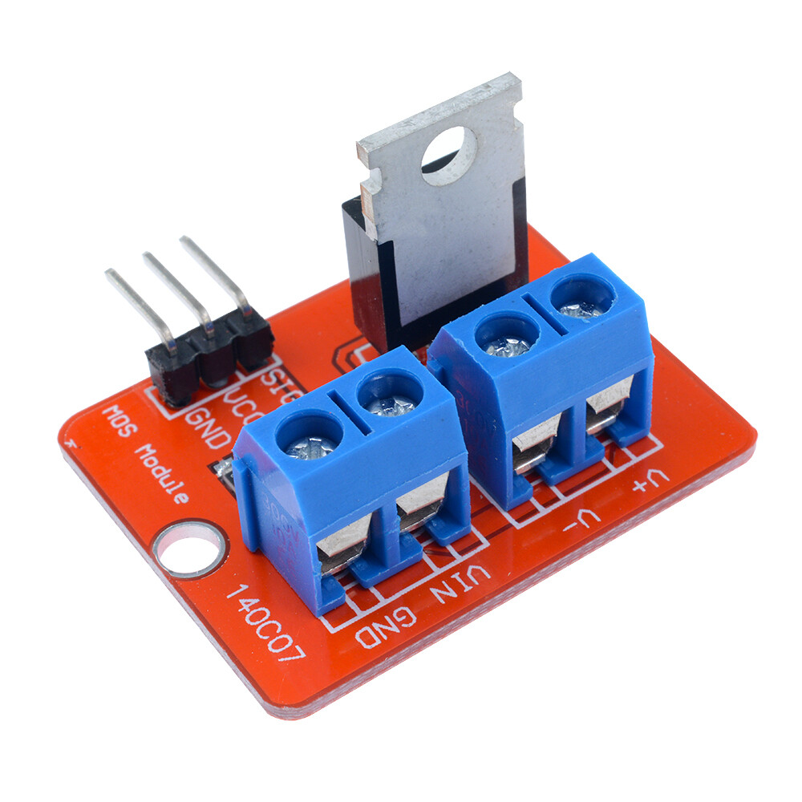
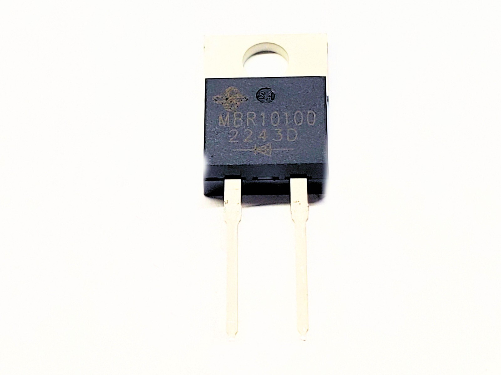
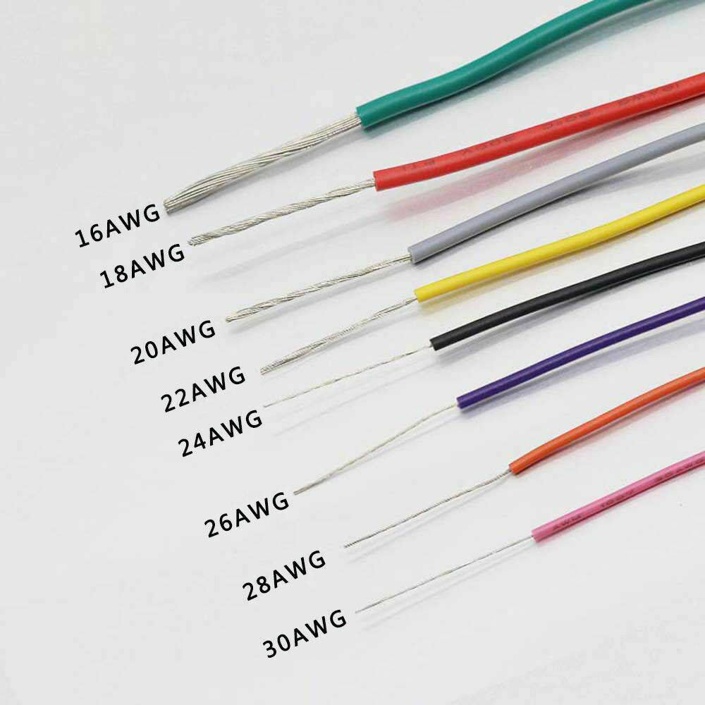
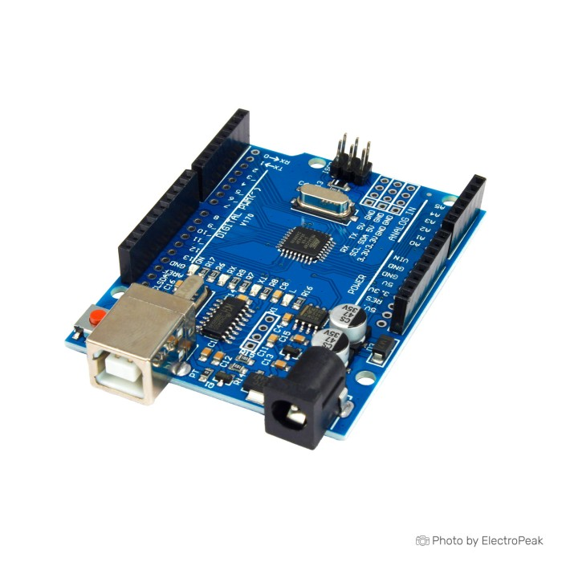
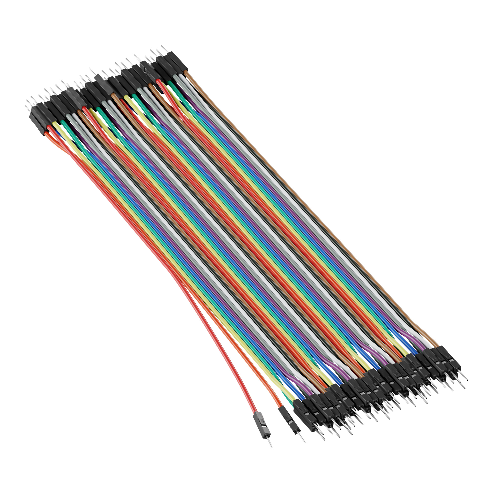
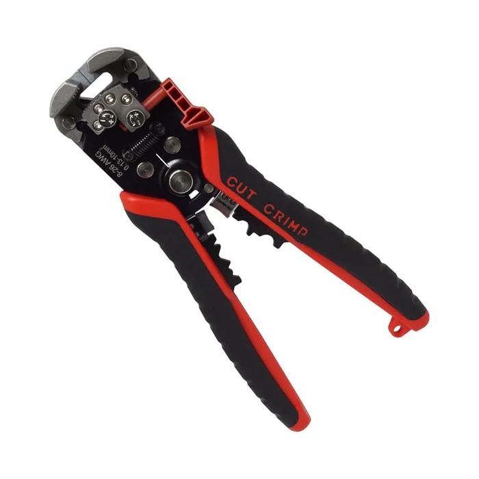
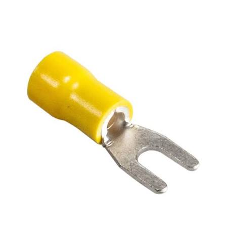
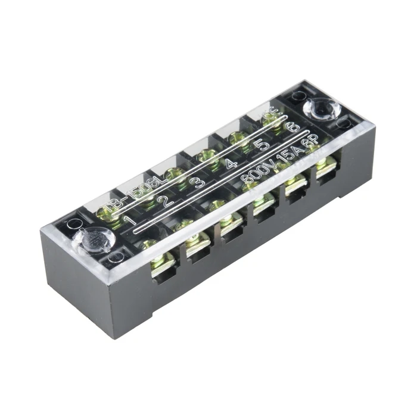
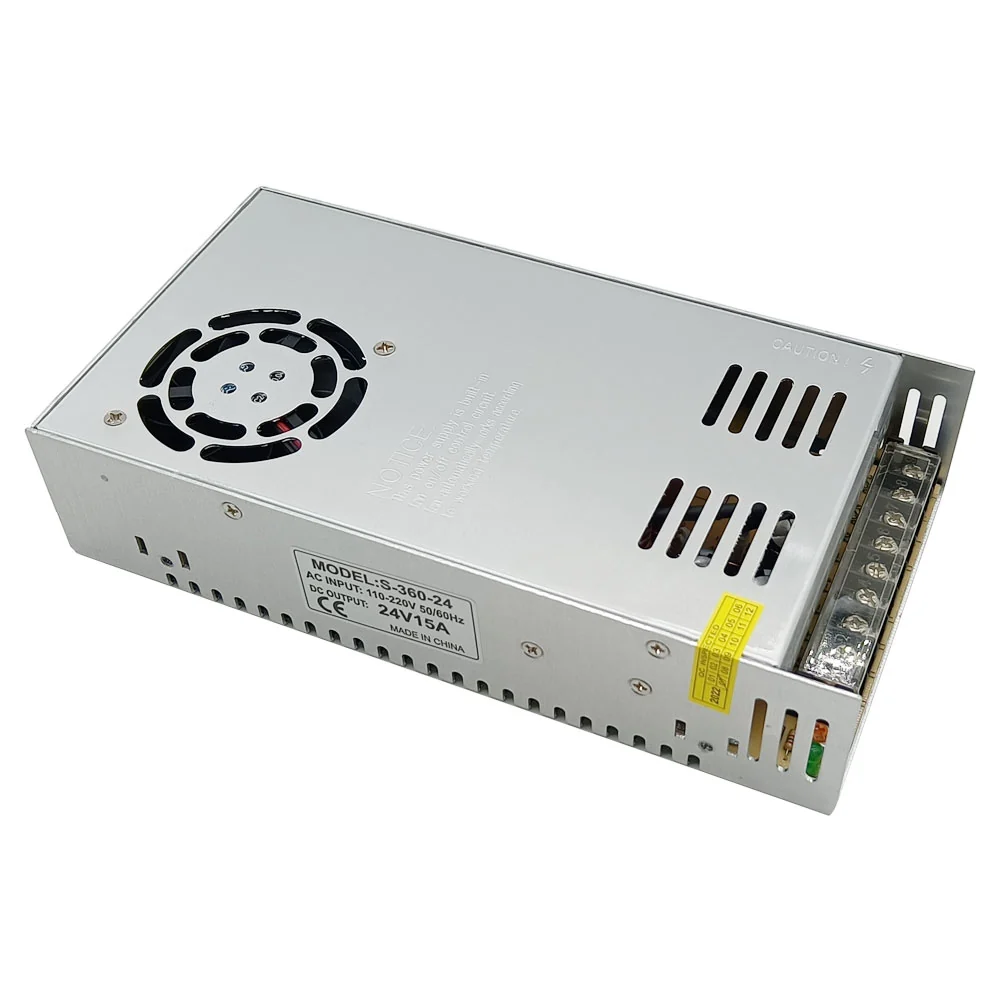

## Wiring

### Components

#### 24v DC Magnet 

#### MOSFET Module IRF520 3.3-5V Turn on, rated for 0-24V

#### Flyback Diode - MBR10100 (REQUIRED)

#### 18AWG Wire

#### Arduino Uno

Arduinos are expensive! But they are also open source! I bought some arduino clones off Alibaba (10 for $35, 1/10 of the price as of 2026)

#### Male to Male Connectors

#### Wire Stripper/Crimper

#### Fork-type Terminal(also called terminal lug)

#### Block Terminal

#### 24V 10A Switching Power Supply

