## Wiring

### Components

#### 24v DC Magnet (1500KG) ~3amps
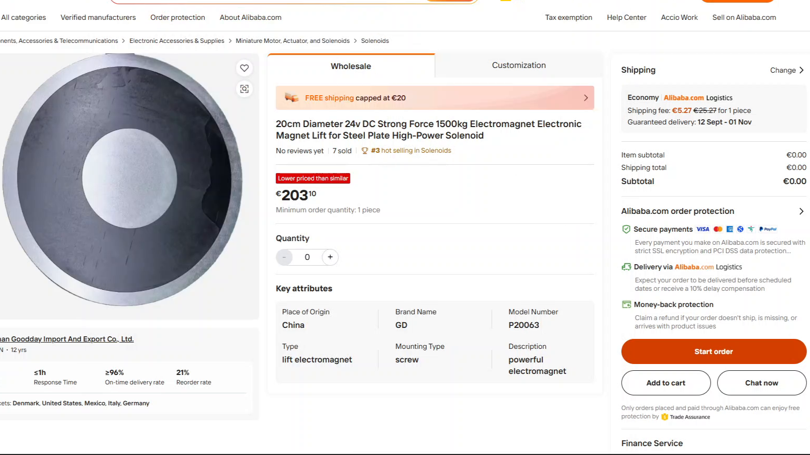

#### MOSFET Module IRF520 3.3-5V Turn on, rated for 0-24V
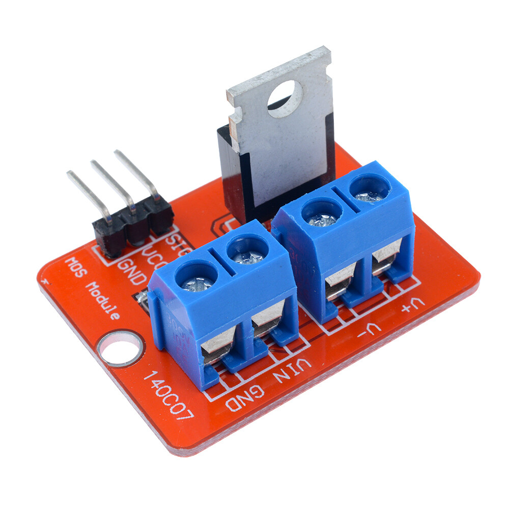
#### Flyback Diode - MBR10100 (REQUIRED)
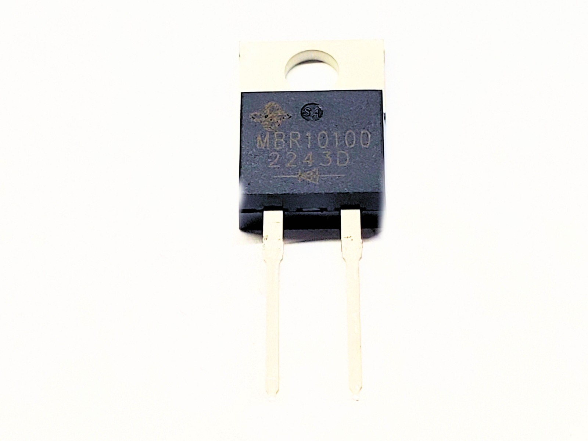
#### 18AWG Wire
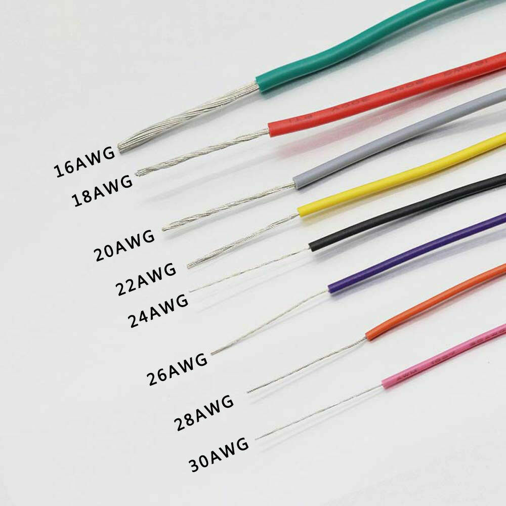
#### Arduino Uno
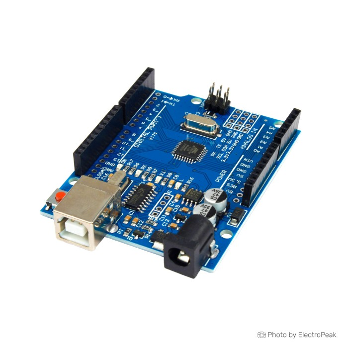

Arduinos are expensive! But they are also open source! I bought some arduino clones off Alibaba (10 for $35, 1/10 of the price as of 2026)

#### Male to Female Connectors

#### Wire Stripper/Crimper
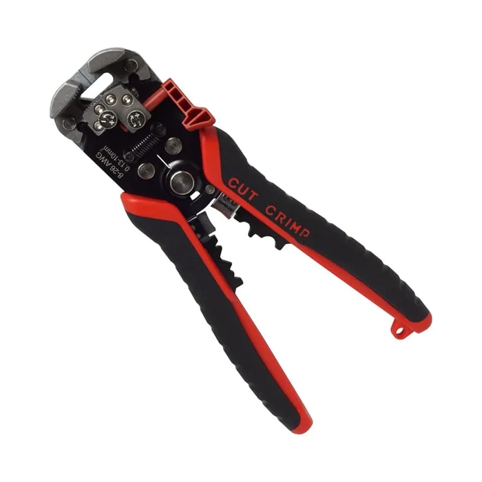
#### Fork-type Terminal(also called terminal lug)
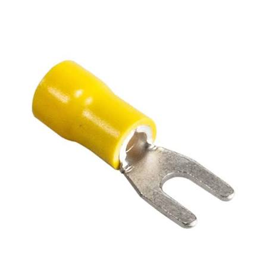
#### Block Terminal
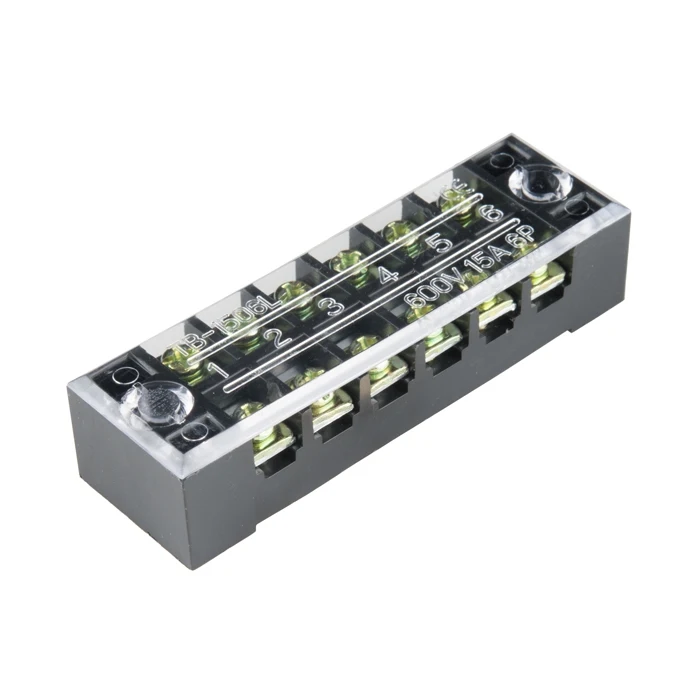
#### 24V 10A Switching Power Supply
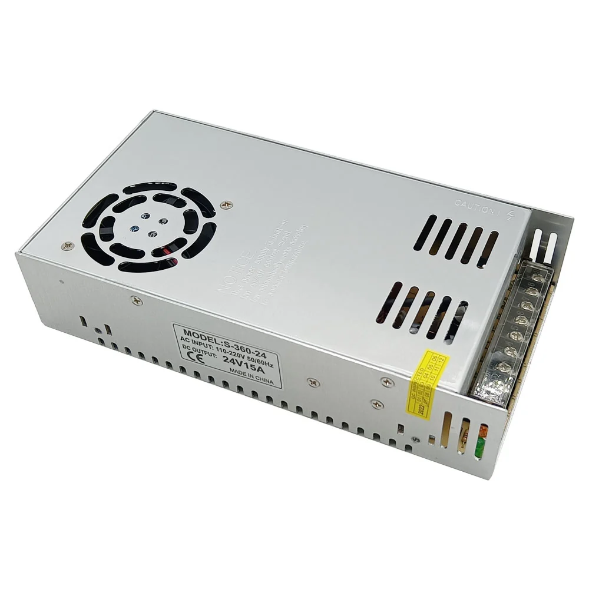

#### Bare Wire
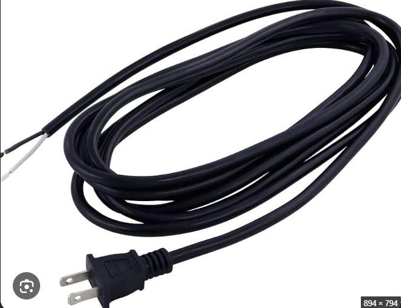

### Assembly

The basic diagram looks something like the following.
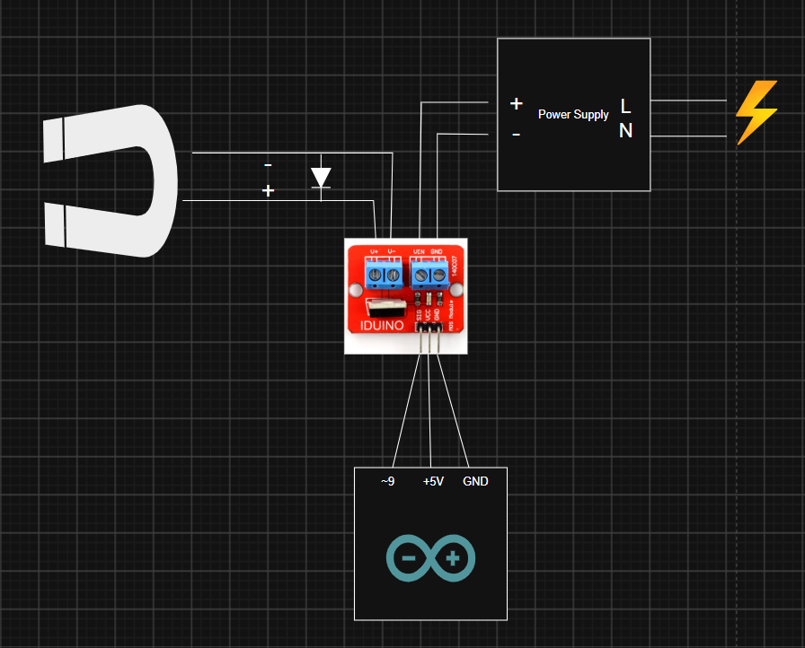

The mosfet module has three pins that help to control the gate. SIGNAL connects to pwm 9, VCC connects to 5V, and GND connects to ground.

To connect the magnet and power supply to the mosfet module I used 4 18awg wires and connected a fork type terminal to one end of each wire. 
The wires on the magnet came bare so I also added fork type terminals to those as well. 

Switching power supplies typically have 2 terminals for AC power. One will be marked as L and the other as N. It doesn't matter much when connecting to the outlet with wire connects to what but following spec helps to keep things clear.

The rest of the terminals on the power supply are for DC power, the terminals on my power supply are separated by a line with the terminals to left being V+ and the right being V-. 

#### Connecting the magnet

I used the remaining two wires that I crimped and connected them to the load side of the mosfet module. To connect the two cables coming from the mosfet and the two cables from the magnet with the flyback diode, I used a terminal block like so.

### Tip
I screwed on the wires coming from the mosfet into the block terminal first. On the other side, I connected one of the wires from the magnet, screwed it down halfway, put the flyback diode in, and then plugged the other wire coming from the magnet. With each wire in place, I screwed down both wires coming from the magnet. 

Note, it is very important that the diode is placed the right way. This will ensure that the inductive spikes have a safe return path. The diode should be in a bridge configuration against the current flow. Be warned, I fried my computer because of this. 

 

My biggest advice is that if you, like me, are finding yourself tearing down and putting the setup back together, always have the v- wire on the same place (last terminal slot on the block terminal ), that way you can't misplace it. 
